# 📺 Immich Folders for TV

<div align="center">


### *Your Immich photo & video library, tailored for the big screen.*

[](https://www.android.com/)
[](https://kotlinlang.org/)
[](https://developer.android.com/jetpack/compose)
[](https://immich.app/)
[](https://buymeacoffee.com/bbxtudios)

<p align="center">
  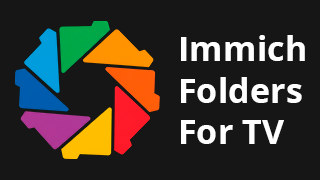
</p>

</div>

---

## 📖 Overview

**Immich Folders for TV** is an unofficial [Immich](https://immich.app/) client built from the ground up for an immersive, fast, and fully remote-friendly (**D-Pad**) experience on **Android TV**, **Google TV**, **Amazon Fire TV**, and widescreen Android devices.

Unlike standard mobile clients, this app focuses on **natural folder-based navigation**, "On This Day" memories, automated **Slideshow presentations**, and high-performance hardware-accelerated video playback.

---

## ✨ Key Features

### 📁 1. Hierarchical Folder & Album Browsing
* Explore the actual directory structure of your Immich library or custom albums.
* Fluid grid layout optimized for 1080p and 4K displays with high-contrast focus indicators.
* Instant media badges (photos, videos, directories).

### 🧠 2. Memories ("On This Day")
* Relive moments captured on today's date across previous years.
* Chronological grouping by years (1 year ago, 3 years ago, 5+ years ago).

### 🎲 3. Random Gallery Discovery
* Rediscover forgotten moments with an instant random photo & video generator.

### 🖼️ 4. Immersive Photo Viewer with Zoom & Slideshow
* Ultra-crisp, full-screen image rendering.
* **Automated Slideshow Mode**: Instant launch with customizable display intervals and looping.
* **Interactive Zoom**: Inspect fine details with a single click on your remote.

### 🎬 5. Hardware-Accelerated Video Player (ExoPlayer / Media3)
* Smooth playback for high-bitrate and 4K home videos.
* **Playback Speed Control**: Cycle through `0.5x`, `1.0x`, `1.25x`, `1.5x`, and `2.0x`.
* Quick seeking (±10 seconds) and responsive scrubber controls.

### 🎮 6. 100% TV Remote (D-Pad) Optimized
* Collapsible **Sidebar Navigation** accessible from the left screen edge.
* Strict focus management ensuring you never lose your position.
* Native integration with **Android TV Leanback Launcher**, **Google TV**, and **Fire OS**.

### 🔄 7. In-App Auto Updater
* Direct notification and in-app installation of new releases via GitHub without requiring ADB.

---

## 📸 Screenshots

> [!NOTE]
> **Disclaimer:** The sample media displayed in these screenshots originates from the official [Immich Demo instance](https://demo.immich.app/) and does not contain personal user data.

<div align="center">

### 📱 Instant QR Login & TV Pairing
| TV Pairing Screen (QR Code & Local Server) | Smartphone Web Pairing Portal |
| :---: | :---: |
| 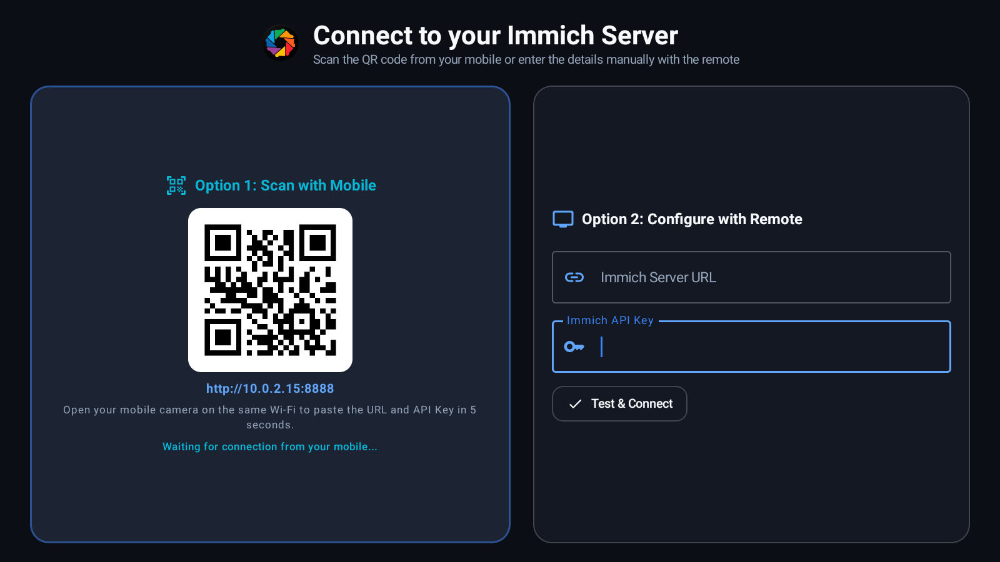 | 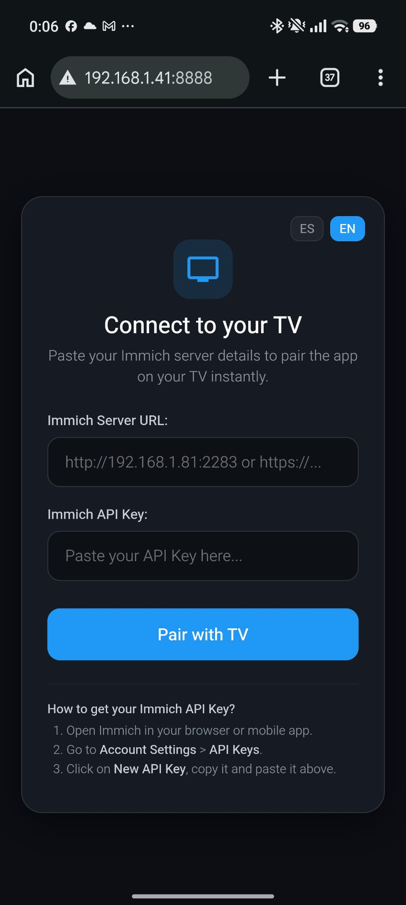 |

### 📁 Folder & Album Browsing
| Folder Explorer (Directories) | Folder Media Gallery (Photos & Videos) |
| :---: | :---: |
| 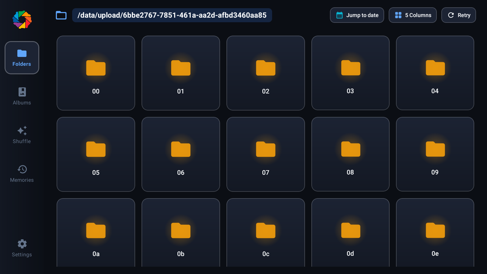 | 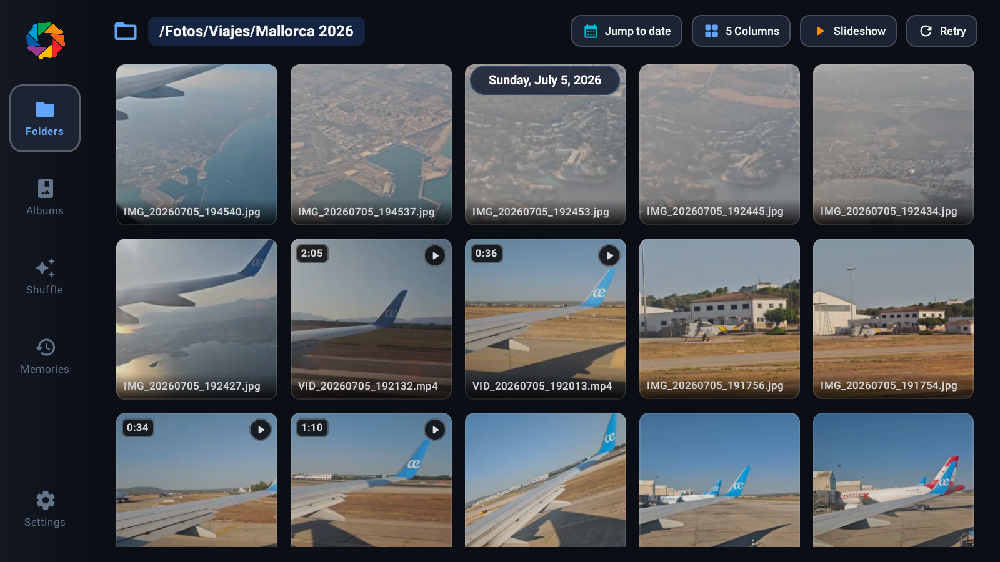 |

| Large Grid View (4 Columns) | Dense Grid View (7 Columns) | 7-Column Albums Grid |
| :---: | :---: | :---: |
| 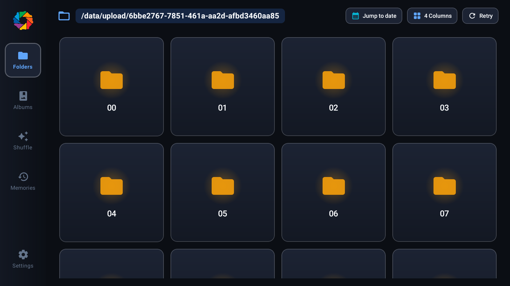 | 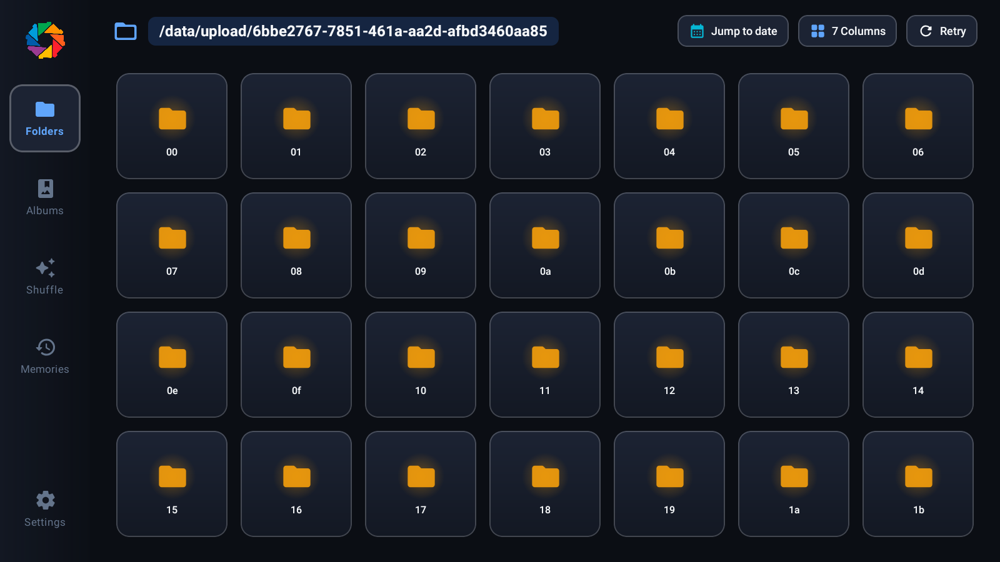 | 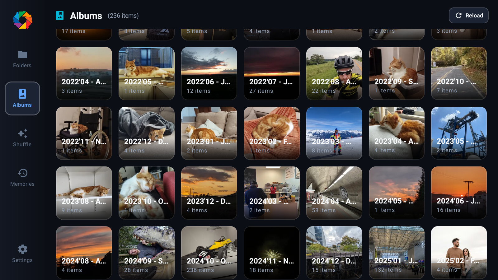 |

| Albums Collection | Album Timeline & Gallery |
| :---: | :---: |
| 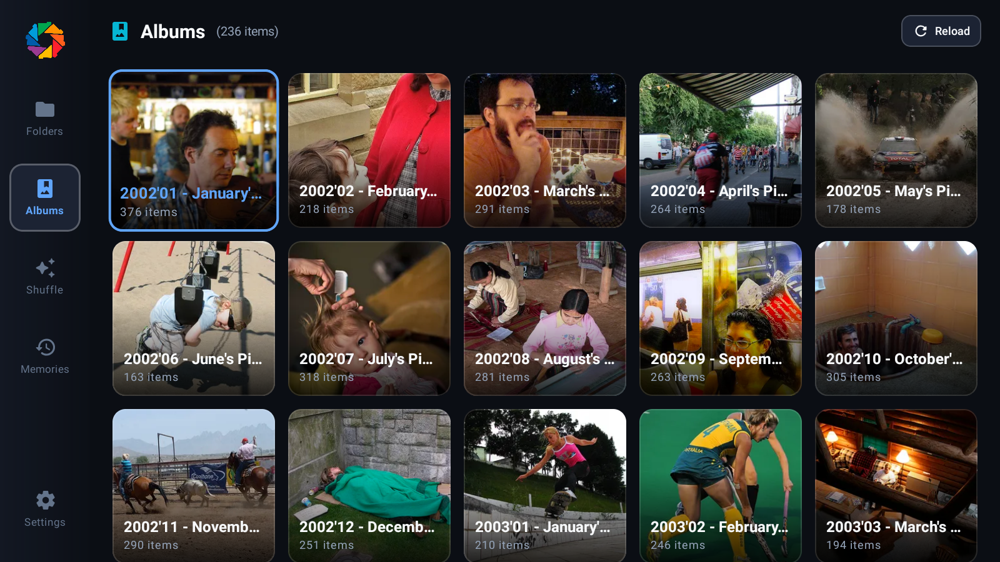 | 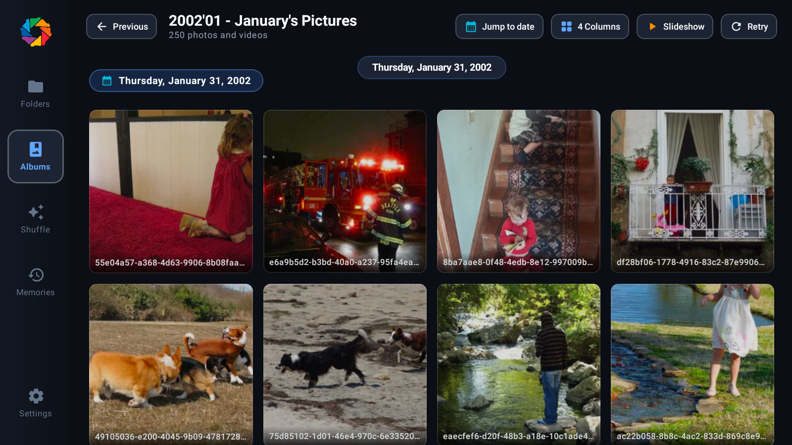 |

### 🖼️ Viewing, Zoom & Video Playback
| Photo Viewer with Zoom & Minimap | Hardware-Accelerated Video Player | Random Discovery (Shuffle) |
| :---: | :---: | :---: |
| 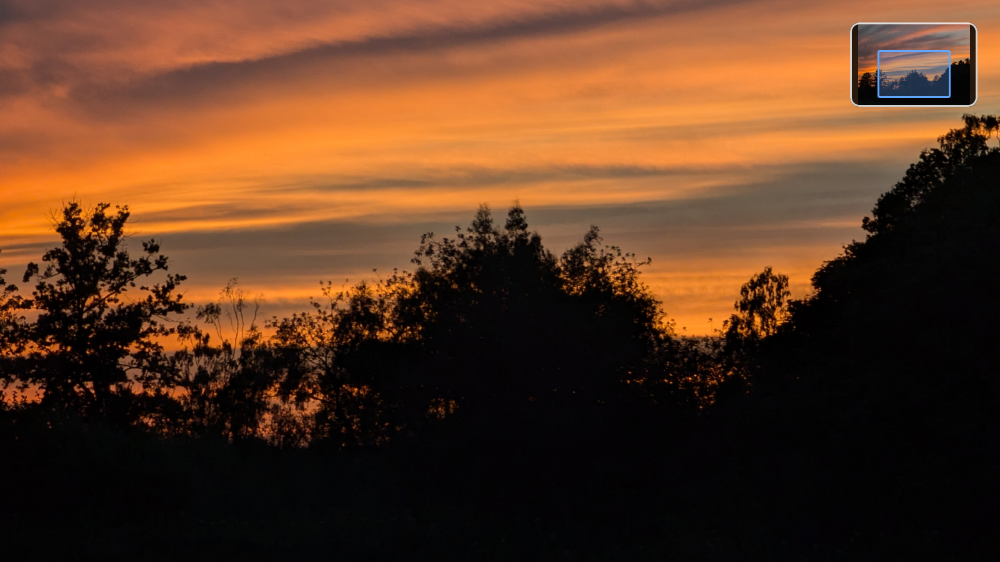 | 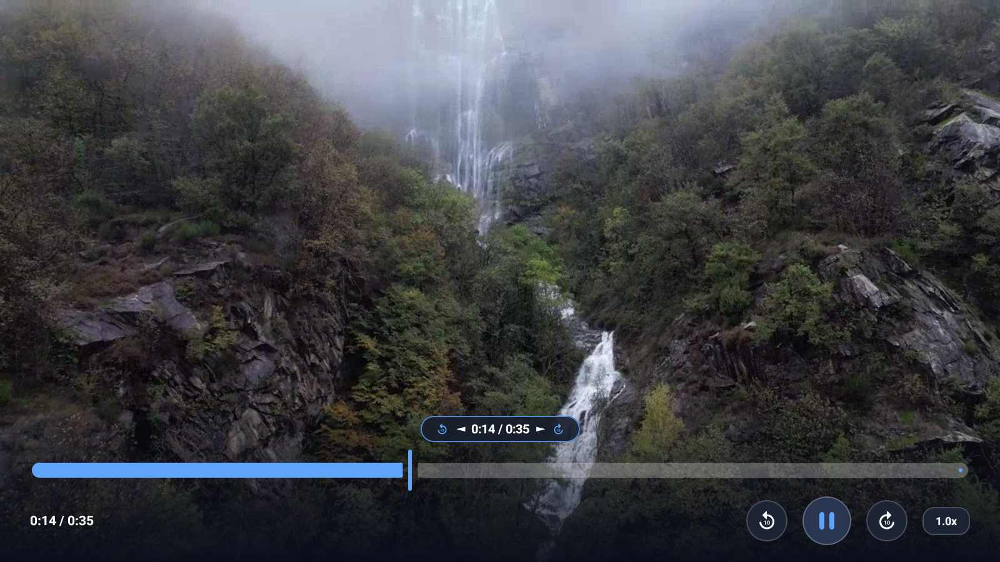 | 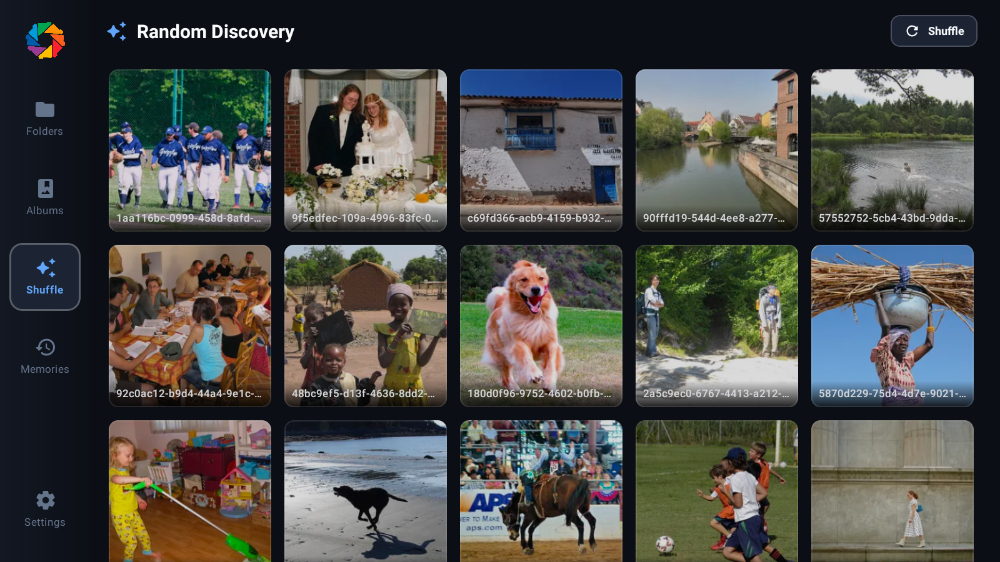 |

### ⚙️ Interactive TV Dialogs & Settings
| Quick Jump to Date | Slideshow Options Dialog | Grid Columns Selector |
| :---: | :---: | :---: |
| 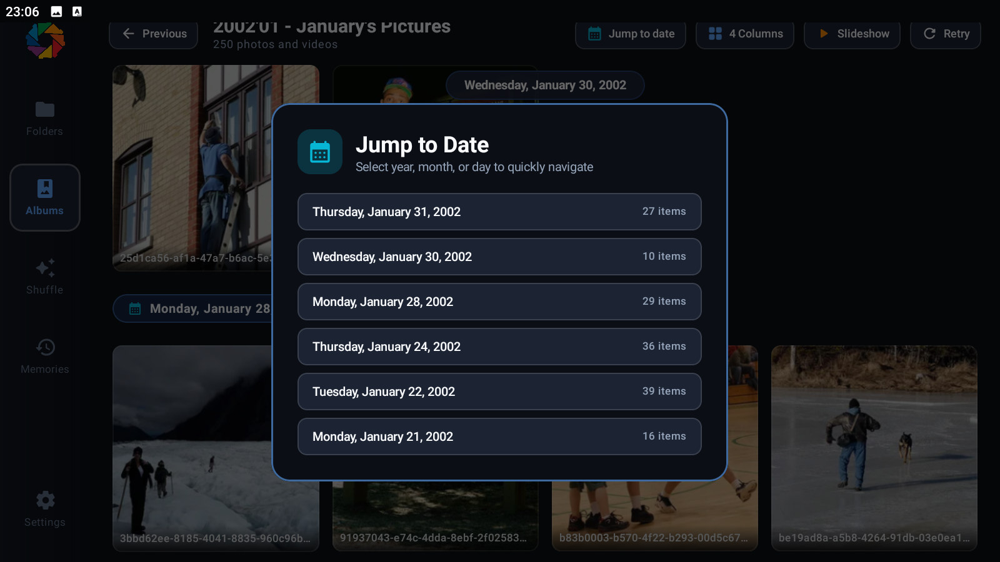 | 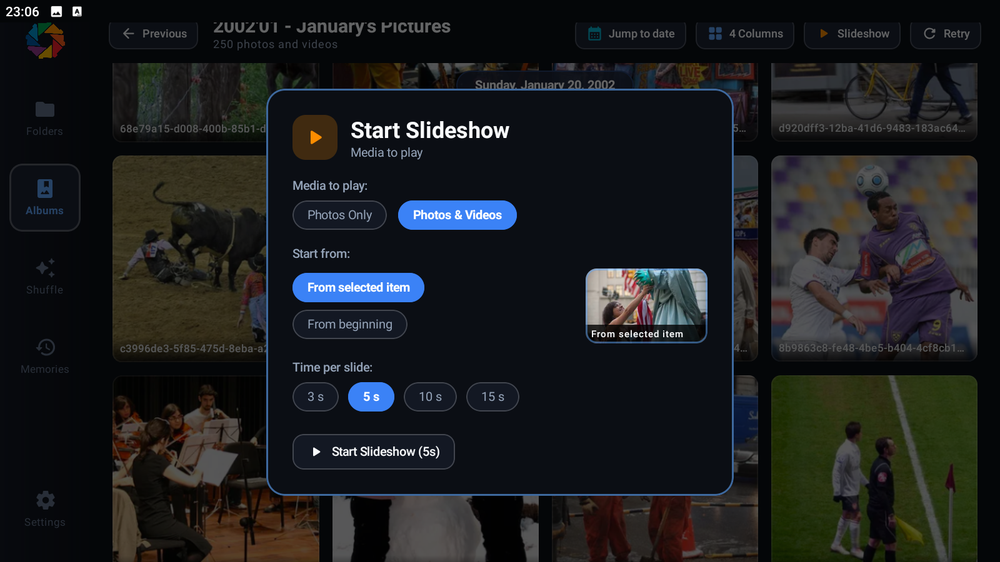 | 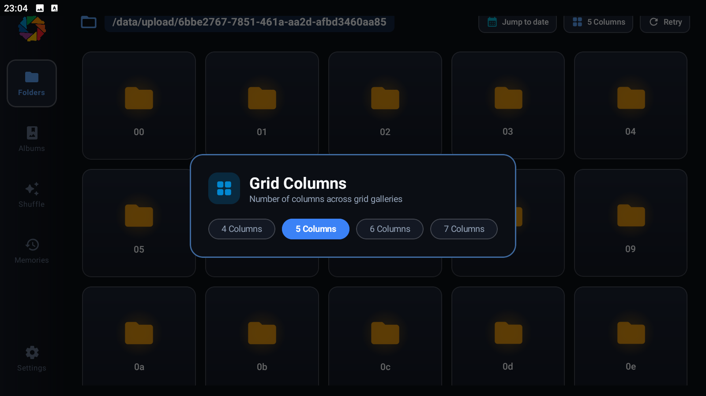 |

| Application Settings Overview | Server & Connection Setup | Viewer & Slideshow Preferences |
| :---: | :---: | :---: |
| 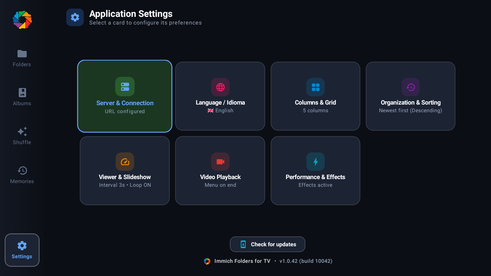 | 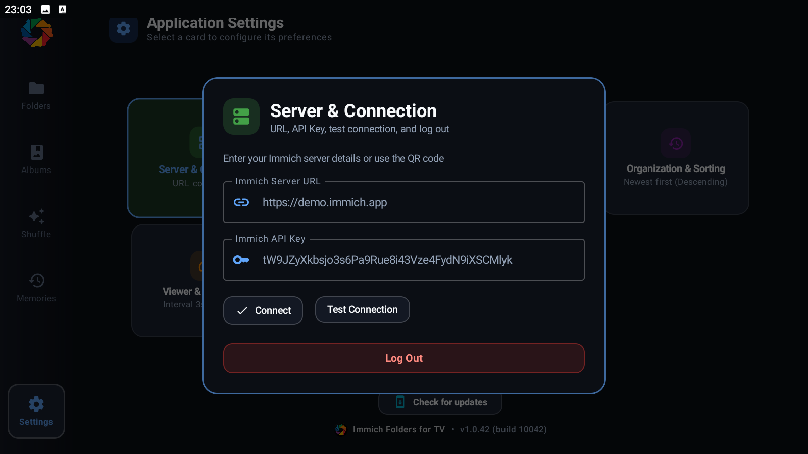 | 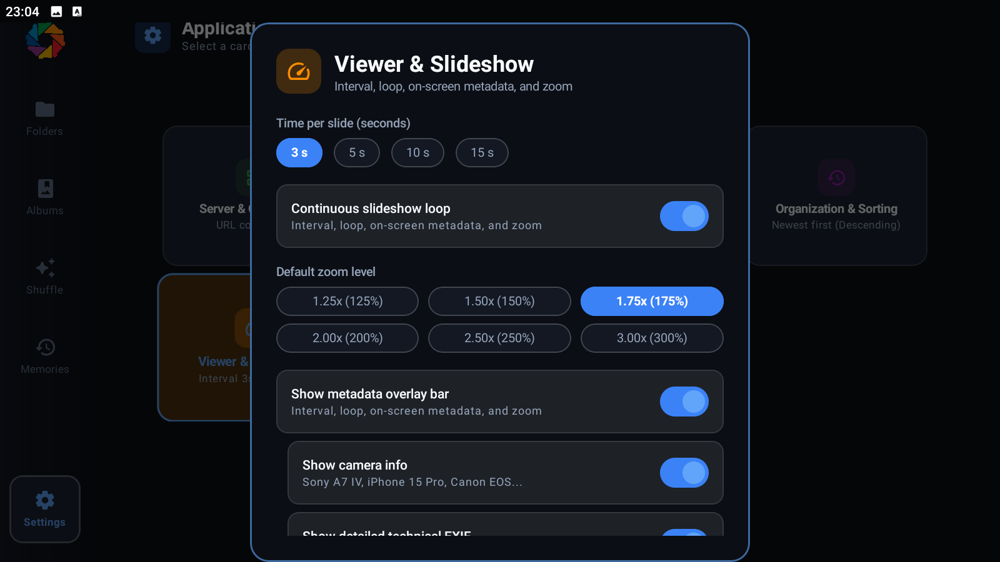 |

</div>

---

## 🕹️ Remote Control (D-Pad) Mapping

Every button is mapped to intuitive contextual actions:

### 🖼️ In the Photo Viewer
| Remote Button | Action |
| :--- | :--- |
| **⬆️ Up Arrow** | **Start / Pause Slideshow Mode** |
| **🔘 Center (OK / Select)** | **Toggle Zoom** (Zoom in for details / Reset full view) |
| **⬅️ / ➡️ Left / Right Arrows** | Previous photo / Next photo |
| **🔙 Back Button** | Exit viewer and return to the folder grid |

### 🎬 In the Video Player
| Remote Button | Action |
| :--- | :--- |
| **🔘 Center (OK / Play-Pause)** | Play / Pause video |
| **⬅️ / ➡️ Left / Right Arrows** | Rewind 10 seconds / Forward 10 seconds |
| **⬆️ / ⬇️ Up / Down Arrows** | **Change Playback Speed** (`0.5x`, `1.0x`, `1.25x`, `1.5x`, `2.0x`) |
| **🔙 Back Button** | Stop playback and return to gallery |

### 📁 In the Gallery & Home Screen
| Remote Button | Action |
| :--- | :--- |
| **⬆️ / ⬇️ / ⬅️ / ➡️ Arrows** | Smooth navigation across items and folders |
| **⬅️ Left Arrow (at the edge)** | Open the **Sidebar Navigation Drawer** |
| **🔘 Center (OK / Select)** | Open selected folder / Open photo viewer / Play video |

---

## 🚀 Initial Setup & Login

When launching the app for the first time, you will be greeted by the login screen. Two methods are available:

```
           ┌─────────────────────────────────────────────────────────────┐
           │                         TV SCREEN                           │
           │  1. Starts a temporary lightweight local HTTP web server   │
           │  2. Displays a QR Code with the local IP address on screen  │
           └──────────────────────────────┬──────────────────────────────┘
                                          │ Scan QR
                                          ▼
           ┌─────────────────────────────────────────────────────────────┐
           │                  SMARTPHONE / TABLET / PC                   │
           │  3. Opens a simple web setup portal in your browser         │
           │  4. Easily paste your Immich Server URL and API Key         │
           │  5. Tap "Save & Connect"                                    │
           └──────────────────────────────┬──────────────────────────────┘
                                          │ Instant LAN Sync
                                          ▼
           ┌─────────────────────────────────────────────────────────────┐
           │  6. The TV receives the credentials and logs in instantly!  │
           └─────────────────────────────────────────────────────────────┘
```

### 📱 Option 1: QR Code Login (⭐️ RECOMMENDED)
Typing long URLs and 50+ character API keys with a TV remote is tedious and error-prone. The app features a smart local pairing system:

1. The TV app **automatically starts a temporary local HTTP server** on your local network.
2. A **QR Code** and local URL are displayed on your TV screen.
3. Using your smartphone (connected to the same Wi-Fi), open the camera and **scan the QR Code**.
4. A clean web page will open where you can **copy and paste**:
   * Your **Immich Server URL** (e.g. `http://192.168.1.100:2283` or `https://photos.yourdomain.com`).
   * Your **API Key** (generated in Immich web interface: *Account Settings > API Keys > New API Key*).
5. Tap **"Save & Connect"**: the TV receives the credentials in milliseconds and signs in immediately.

---

### ⌨️ Option 2: Manual Setup (Not Recommended)
If you prefer not to use a phone, you can use the on-screen form:
* Use the virtual on-screen keyboard with your remote to type your server URL and API Key.
> ⚠️ *Note: Due to the complexity and length of Immich API keys, using the QR method is strongly advised.*

---

## 🛠️ Tech Stack & Architecture

* **Language:** [Kotlin](https://kotlinlang.org/) (100%)
* **UI Framework:** [Jetpack Compose for TV](https://developer.android.com/tv/posture/compose) + Material 3
* **Concurrency:** Kotlin Coroutines & Asynchronous `StateFlow`
* **Networking:** [Retrofit 2](https://square.github.io/retrofit/) + [OkHttp 3](https://square.github.io/okhttp/) (Immich REST API v1)
* **Image Loading & Disk Caching:** [Coil](https://coil-kt.github.io/coil/)
* **Media Engine:** [AndroidX Media3 / ExoPlayer](https://developer.android.com/media/media3)
* **Persistence:** AndroidX DataStore
* **Target Compatibility:** Android 8.0 (API 26) or higher

---

## 📦 Download & Installation

1. Download the latest `.apk` from the **[Releases](https://github.com/bbxtudios/Immich-Folders-for-TV/releases)** page.
2. Sideload onto your Android TV / Fire TV Stick using:
   * **Downloader** app (entering direct download URL).
   * **Send Files to TV** app.
   * Or via **ADB**:
     ```bash
     adb install -r immich-folders-for-tv.apk
     ```

---

## ☕ Support the Project

If you find **Immich Folders for TV** useful and would like to support its ongoing development and maintenance, consider buying me a coffee!

<p align="center">
  <a href="https://buymeacoffee.com/bbxtudios" target="_blank">
    
  </a>
</p>

---

<div align="center">
Made with ❤️ for the <b>Immich</b> community.
</div>
